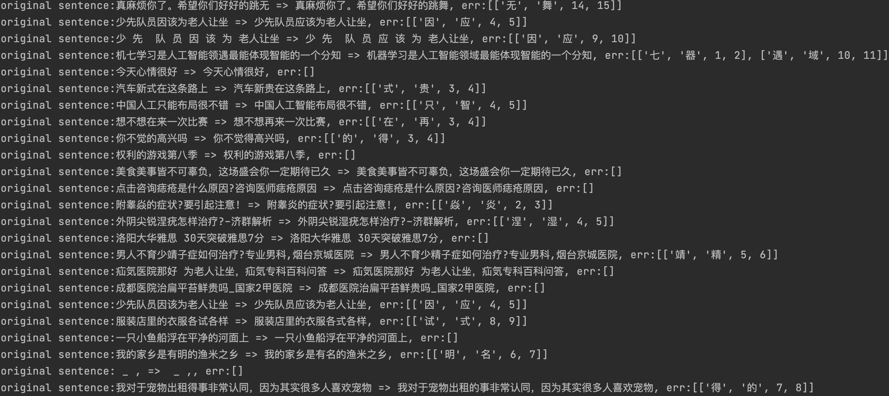

# MacBertMaskedLM For Correction

## 使用说明

1. 下载用开源的中文文本纠错数据集fine-tune后的预训练MACBERT MLM模型（飞书文档链接: https://szuy1h04n8.feishu.cn/file/boxcnoKfHHtjokcZojQO2VjtQHB
   密码: QKz3），解压后放置于`~/.pycorrector/dataset/macbert_models/chinese_finetuned_correction`目录下。

```
macbert_models
└── chinese_finetuned_correction
    ├── config.json
    ├── added_tokens.json
    ├── pytorch_model.bin
    ├── special_tokens_map.json
    ├── tokenizer_config.json
    └── vocab.txt
```

2. 运行`macbert_corrector.py`进行纠错。

```
python3 macbert_corrector.py
```

3. 评估

- run
  `python tests/macbert_corrector_test.py`
- result
  

纠错结果除部分英文大小写问题外，在sighan15上达到了SOTA水平。

### Evaluate

提供评估脚本[pycorrector/utils/eval.py](../utils/eval.py)，该脚本有两个功能：

- 构建评估样本集：评估集[pycorrector/data/eval_corpus.json](../data/eval_corpus.json),
  包括字粒度错误100条、词粒度错误100条、语法错误100条，正确句子200条。用户可以修改条数生成其他评估样本分布。
- 计算纠错准召率：采用保守计算方式，简单把纠错之后与正确句子完成匹配的视为正确，否则为错。

执行该评估脚本后，

MacBert模型纠错效果评估如下：

- 准确率：56.20%
- 召回率：42.67%

规则方法(加入自定义混淆集)的纠错效果评估如下：

- 准确率：320/500=64%
- 召回率：152/300=50.67%

MacBert模型在sighan15上纠错效果评估如下：

- 准确率：63.64%
- 召回率：63.64%

由于训练使用的数据使用了sighan15的训练集，故在sighan15的测试集上表现较优，此外，由于未使用pycorrector提供的训练数据，故在首个文件的评估结果中表现一般，如需在特定训练请使用[https://github.com/gitabtion/BertBasedCorrectionModels](https://github.com/gitabtion/BertBasedCorrectionModels)进行数据的处理及训练，并使用该仓库给出的state_dict转换脚本获取pytorch_model.bin，并复制至本模型所指定的目录。

## 快速加载

本项目基于pycorrector迁移的`pycorrector/transformers`，可支持BERT模型，可通过如下命令调用。当然，你也可使用官方的transformers库进行调用。

example: [correct_demo.py](correct_demo.py)

```python
from pycorrector.macbert.macbert_corrector import MacBertCorrector

model_dir = "~/.pycorrector/dataset/macbert_models/chinese_finetuned_correction"
nlp = MacBertCorrector(model_dir).macbert_correct

i = nlp('今天新情很好')
print(i)

```

如果你需要直接使用huggingface/transformers调用

1.先pip安装transformers库:

```
pip install transformers
```
2.使用以下示例执行：

```python
import torch
from transformers import AutoTokenizer, AutoModel

model_dir = "~/.pycorrector/dataset/macbert_models/chinese_finetuned_correction"
model = AutoModel.from_pretrained(model_dir)
tokenizer = AutoTokenizer.from_pretrained(model_dir)

text = ["今天心情很好", "你找到你最喜欢的工作，我也很高心。"]
outputs = model(**tokenizer(text,padding=True, return_tensors='pt'))
corrected_text = tokenizer.decode(torch.argmax(outputs.logits, dim=-1), skip_special_tokens=True)

print(corrected_text)
```

## 训练

如果需要训练，请参考[https://github.com/gitabtion/BertBasedCorrectionModels](https://github.com/gitabtion/BertBasedCorrectionModels)